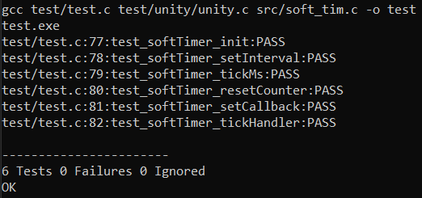

# software timer in c

## For test (without Makefile)
```sh
$ gcc test/test.c test/unity/unity.c src/soft_tim.c -o test
```

## For test (with Makefile)
```sh
$ make test-build
$ make test-run
$ make test-iterate
$ make test-clean
```

